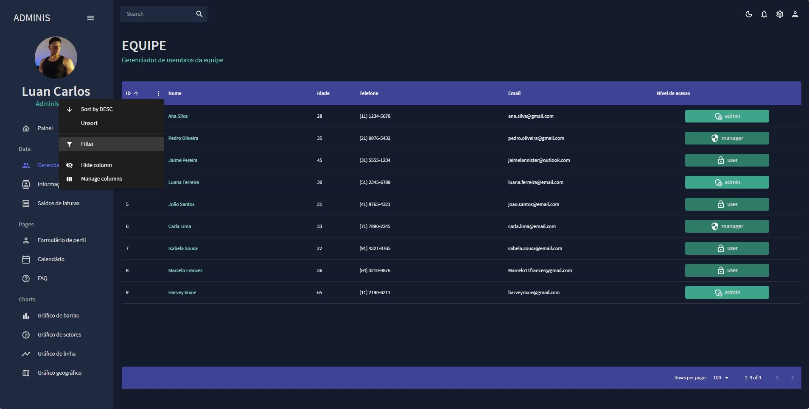
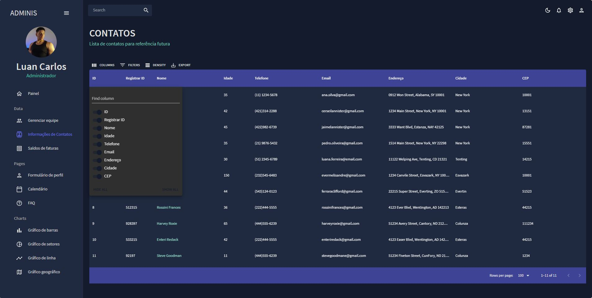
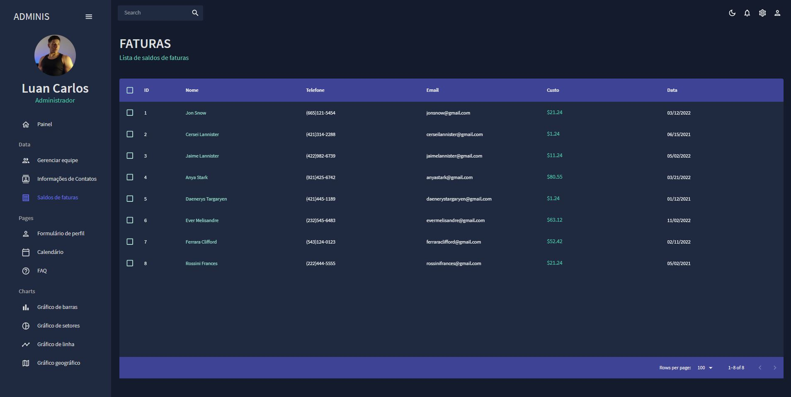
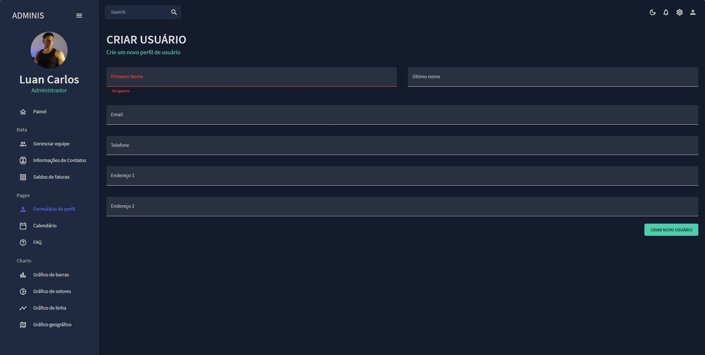
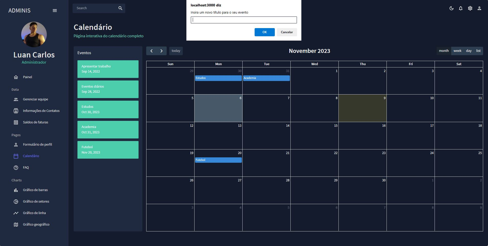
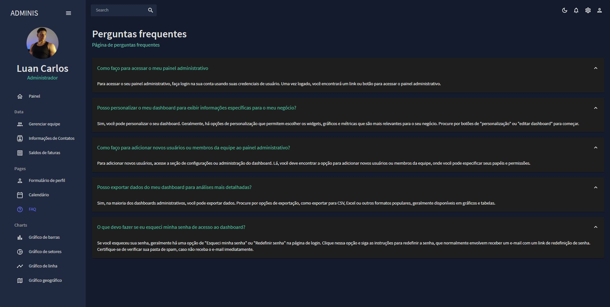
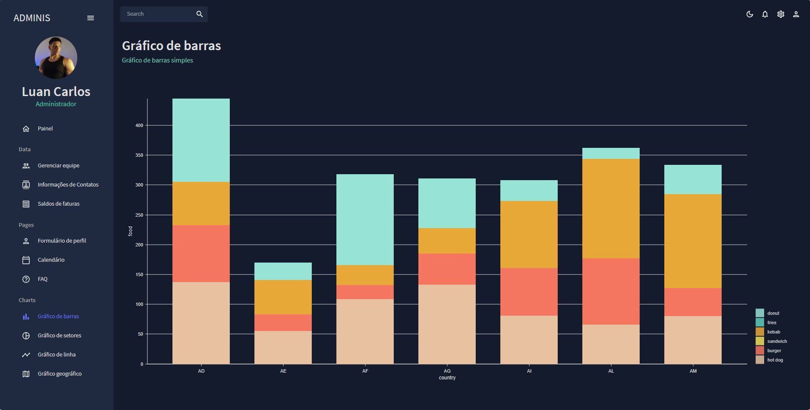
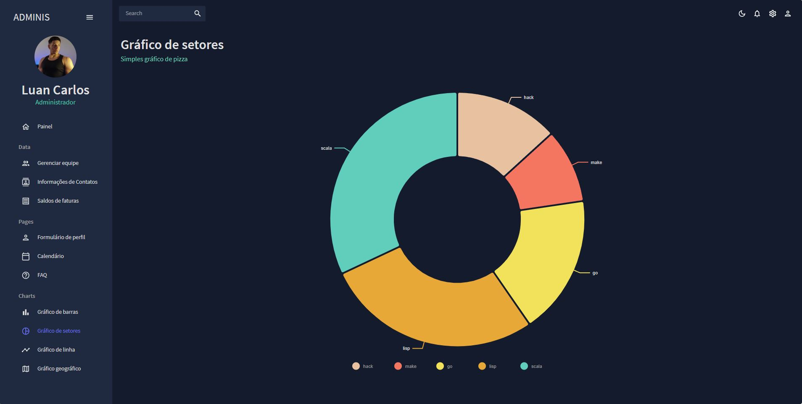
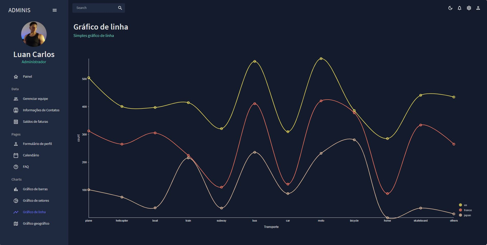
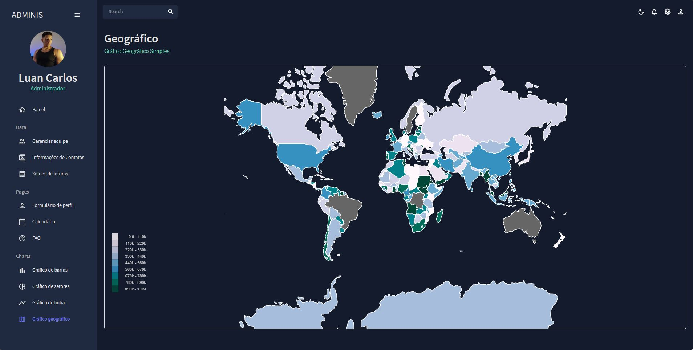

<h1 align="center">Dashboard</h1><br>

### Desktop (screenshot):

| Dark Mode  | White Mode | 
| --- | --- |
|  |  | 

| Team | Contacts |
| --- | --- |
|  |  |

| Invoices  | Form | 
| --- | --- |
|  |  | 

| Calendar | FAQ |
| --- | --- |
|  |  |

| Bars  | Pizza | 
| --- | --- |
|  |  | 

| Lines | Geography |
| --- | --- |
|  |  |

---
Dashboard baseado em dados reais com a interface criada com Material UI

## 🚀 Introdução
Desenvolvi um dashboard React robusto, simplificando dados complexos em visualizações intuitivas. A interface dinâmica oferece insights instantâneos, promovendo uma análise eficiente. Integração fluida e design responsivo garantem uma experiência de usuário otimizada.

## :clipboard: Pré-requisitos

- [Node.js 12+](https://nodejs.org/en/download/)
- [Yarn](https://classic.yarnpkg.com/en/docs/install/#windows-stable)

## :wrench: Instalação

Para clonar o projeto via HTTPS execute o seguinte comando:
```
git clone https://github.com/Luancss/react-admin-dashboard
```
Em seguida instale as dependências:
```
npm install
```

## 🔨 Execução em ambiente de desenvolvimento

```
npm start
```

## :hammer_and_wrench: Principais tecnologias utilizadas
- [Create-react-app](https://create-react-app.dev/) - Conjunto de scripts para criar facilmente um projeto React pré-configurado.
- [Material UI](https://mui.com/material-ui/) - Biblioteca de componentes React que implementa o design do Material Design
- [Nivo Charts](https://nivo.rocks/) - Biblioteca React para construção de gráficos reutilizáveis e elegantes.
- [Formik](https://formik.org/) - Biblioteca para gerenciar formulários em React com facilidade.
- [Full Calendar](https://fullcalendar.io/) - Plugin JavaScript para exibição de calendários interativos no navegador.
- [React Pro Sidebar](https://github.com/azouaoui-med/react-pro-sidebar) -  Barra lateral responsiva e personalizável para aplicações React.
- [Yup](https://github.com/jquense/yup) - Biblioteca para validação de formulário largamente utilizada em projetos Javascript.

## ✍ Author


<p>
    Made with 💜 by Luancss
</p>
<p align="left">
    <a href="https://www.linkedin.com/in/luan-carlos-30035b246/" target="_blank">
        
    </a>
    <a href="mailto:luancss.contact@gmail.com" target="_blank">
        
    </a>
</p>

Feito com :heart: por [Luan Carlos](https://github.com/Luancss)
